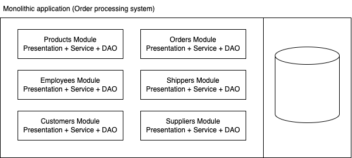
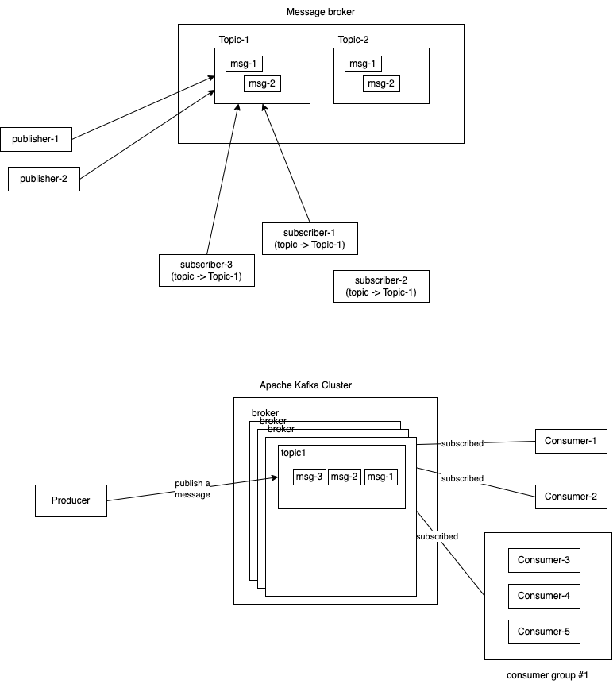

- monolithic applications
  - one huge software system
  - layered
    - frontend (client tier)
    - middleware
      - presentation layer
      - service layer
      - repository (DAO) layer
    - backend (EIS)
      - database management system

- Microservice architecture
  - every module can be a separate application
  - each service is just a middleware (api)
    - REST
    - GraphQL
  - frontend is now decoupled from the application
    - web
      - angular
      - react
      - vuejs
    - mobile/tablets
      - flutter
      - react native
      - swift
      - android app development
  - DB is also dedicated
  - each service is now scalable independent of other services

### Need for a better system

#### Cab booking system

- When a ride is booked, assume that the average ETA is 4 minutes
- 4 minutes = 4\*60 = 240 seconds
- every 1 second, the app on driver's phone sends the location information to the server
- each of these location `record` is now stored in the database
- the ride customer's app sends a request every 1 second to get new location information in the db
- and then updates the UI

- 200000 _ 5 _ 60 = 60,000,000 records inserted every 5 mintues
- 200000 records per second (throughput - TPS)

- Average TPS for mysql would be around 230
- expectation from this app alone for a very very tyny customer group is 200000
- the db breaks down

### Messaging System

- essential components of modern applications
- facilitate communication and data exchange between various parts of application or different microservices
- enables asynchronous communication
- decoupled applications
  - the producer of the message does not send message to the consumer of the message directly
  - the concept of message brokers come in
- message broker guarantees a reliable message delivery
  - Apache Active MQ
  - RabbitMQ
  - Apache Kafka (append only logs)
- highly scalable (horizontal)
- offer high throughput

### Common messaging patterns

- Publish-Subscribe (pub/sub)
  - producer of the message `publishes` to the broker
  - one or more subscribers will get these messages from the broker
- Point-to-point (PTP or P2P)
  - a message from a producer is intented for a single consumer
- Message queue

### Advantages of Messaging systems:

- Loose coupling
- highly scalable (horizontal)
- highly reliable
- highly fault tolerant
- programming language agnostic, since the messages are in interoperable formats (csv/json/avro/protobuf/..)

## Apache Kafka

- open source software
- distributed
- high throughput
- event streaming platform
- enables horizontal scaling via clusters (1000s)
- low latency (< 2ms)
- Created at LinkedIn in early 2010
- 2011 - open sourced under apache licence
- 2012 - entered the apache software foundation incubation
- name is a homage to an author Franz Kafka

### Some usecases:

- Real time analytics on peta bytes of data
- Log aggregation
- Build microservices
- Data integration

### Different componets involved in Apache Kafka environment

- Producers: an application or service that publish data streams (related to events ) to Kafka server
  - don't send message directly to the consumer
- Consumers: applications or services that subscribe to `topics` and read data streams from kafka server
  - can belong to `groups`
  - each member of a group can consume a portion of messages
    - allows parallel processing and fault tolerance
- Topics: categories or feeds for data streams
  - a topic holds an ordered sequence of messages published by producers
  - for scalability and fault tolerance, a topic is further divided into smaller units called `partitions`
- Brokers: Servers that form a kafka cluster
  - responsible for
    - storing messages published by producers
    - managing partitions
    - delivery of messages to consumers
- ZooKeeper: Not part of the core data flow
  - coordinates the activities with in a kafka cluster
  - maintains the cluster configuration, including list of brokers, topics, consumer groups

